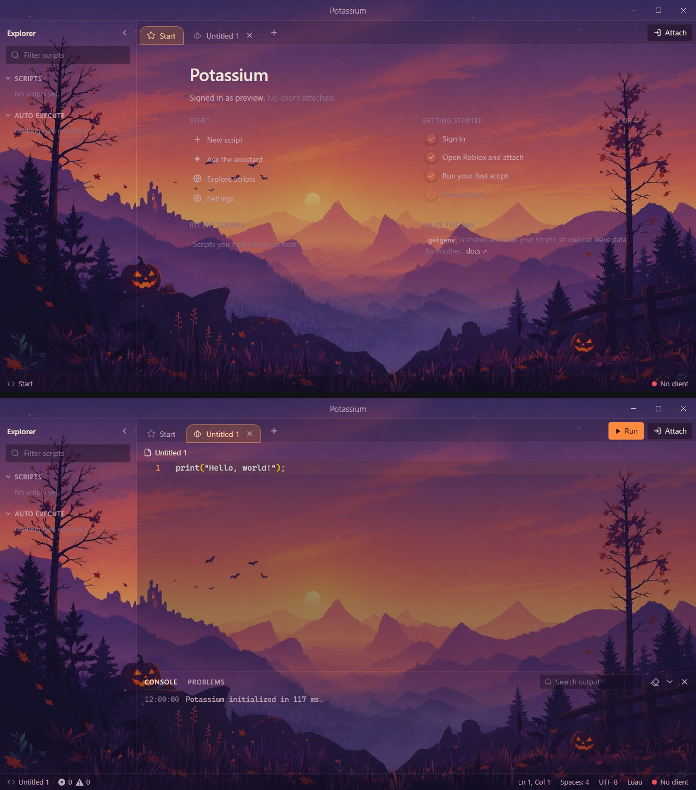
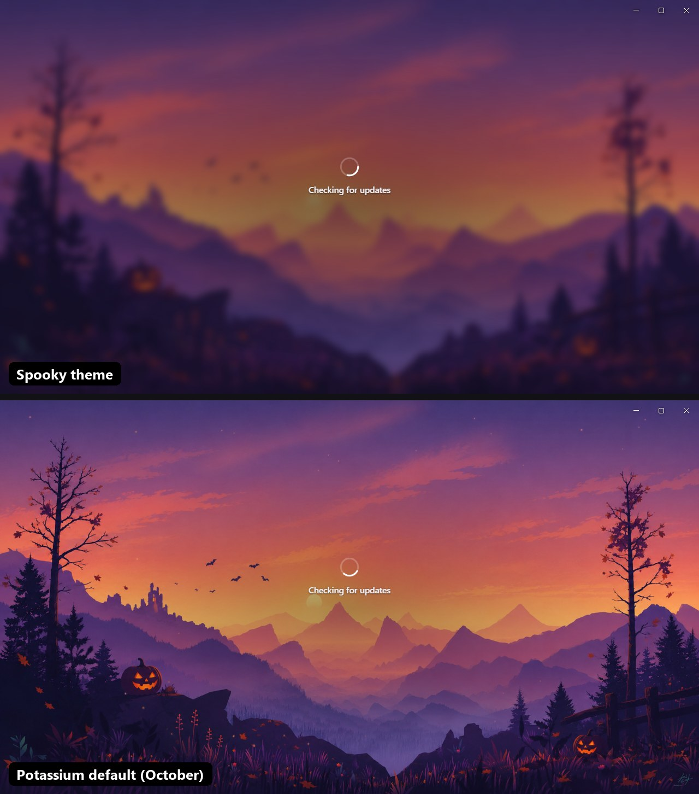

# Spooky theme for Potassium

A Halloween theme for the Potassium executor: pumpkin-orange accents, a warm plum palette, see-through panels and the Halloween login wallpaper behind the whole app.

The wallpaper on its own: [`halloween.jpg`](halloween.jpg).

## Loading screen

The theme also replaces Potassium's own loading and login picture with its wallpaper, softly blurred. Underneath is Potassium's own October loading screen, which this theme's wallpaper comes from.

## Install

1. In Potassium, open **Settings → Appearance → Custom theme**.
2. Set **Base theme** to **Dark**. The editor's syntax colours come from the base theme.
3. Copy everything in [`Theme.css`](Theme.css) and paste it into **Custom CSS**.
4. Type a name (for example `Halloween`) under **Save** and click **Save**.

## Notes

- The wallpaper loads from `halloween.jpg` in this repo, so you need internet the first time. If the image can't load, the colours still apply.
- Potassium cuts custom CSS off at 50,000 characters. This theme is about 2,000, so there's plenty of room to add your own tweaks.
- The editor and settings-screen rules target Potassium's internal class names. A future Potassium update could rename them; if that happens, the colours keep working but the see-through editor or the solid settings screen may not.
- The wallpaper is an AI-generated Halloween edit of "The Valley" by [Louis Coyle](https://louie.co.nz), taken from Potassium's own seasonal theme.
